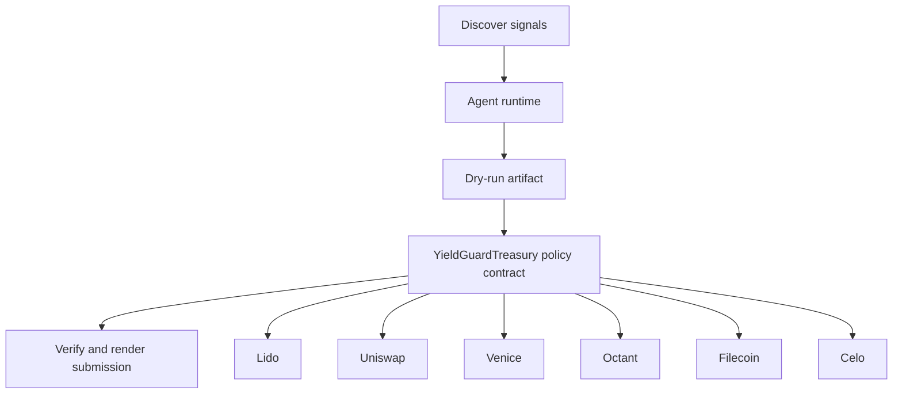

# YieldGuard Autonomous Public Goods Swarm

- **Repo:** `Synthesis-YieldGuard-OpenTrack`
- **Primary track:** Open Track
- **Category:** public_goods
- **Submission status:** implementation ready, waiting for credentials and TxIDs.

A yield-only autonomous public-goods swarm that discovers funding gaps, spends only staking yield through bounded delegations, stores impact proofs, and updates agent receipts.

## Selected concept

A coordinator agent scans Octant and onchain public-goods signals, routes sensitive ranking through Venice, and creates dry-run action bundles. A yield guard contract records per-target caps, time windows, and delegated execution so sub-agents can route Lido yield through Uniswap, Celo, Locus, and Filecoin without touching principal, then store proofs and update ERC-8004 receipts.

## Idea shortlist

1. YieldGuard Autonomous Public Goods Swarm
2. ENS-Native Private Governance Swarm
3. Lido Yield Routing Commons
4. Proof-of-Impact Market Mesh

## Partners covered

Lido, Uniswap, Venice, Octant, Filecoin, Celo, ERC-8004 Receipts, Bankr Gateway, MetaMask Delegations, PayWithLocus, ENS, Olas, Slice

## Architecture



## Repository layout

- `src/`: shared policy contracts plus the repo-specific wrapper contract.
- `script/`: Foundry deployment entrypoint.
- `agents/`: Python runtime, partner adapters, and project metadata.
- `scripts/`: CLI utilities for running the loop and rendering submissions.
- `docs/`: architecture, credentials, demo script, and security notes.
- `submissions/`: generated `synthesis.md` snippet for this repo.

## Action catalog

| Action | Partner | Purpose | Max USD | Sensitivity |
| --- | --- | --- | --- | --- |
| `lido_yield_route` | Lido | Use Lido for a bounded action in this repo. | $200 | medium |
| `uniswap_quote_route` | Uniswap | Use Uniswap for a bounded action in this repo. | $220 | medium |
| `venice_private_analysis` | Venice | Use Venice for a bounded action in this repo. | $5 | high |
| `octant_signal_publish` | Octant | Use Octant for a bounded action in this repo. | $25 | medium |
| `filecoin_proof_store` | Filecoin | Use Filecoin for a bounded action in this repo. | $20 | medium |
| `celo_payment_settle` | Celo | Use Celo for a bounded action in this repo. | $150 | low |
| `erc_8004_receipts_receipt_anchor` | ERC-8004 Receipts | Use ERC-8004 Receipts for a bounded action in this repo. | $1 | medium |
| `bankr_gateway_compute_route` | Bankr Gateway | Use Bankr Gateway for a bounded action in this repo. | $10 | high |
| `metamask_delegations_delegate_scope` | MetaMask Delegations | Use MetaMask Delegations for a bounded action in this repo. | $2 | high |
| `paywithlocus_subaccount_pay` | PayWithLocus | Use PayWithLocus for a bounded action in this repo. | $120 | medium |
| `ens_ens_publish` | ENS | Use ENS for a bounded action in this repo. | $5 | low |
| `olas_market_hire` | Olas | Use Olas for a bounded action in this repo. | $20 | medium |
| `slice_checkout_hook` | Slice | Use Slice for a bounded action in this repo. | $35 | medium |

## Commands

```bash
python3 -m unittest discover -s tests
forge test
python3 scripts/run_agent.py
python3 scripts/plan_live_demo.py
python3 scripts/render_submission.py
```

## Credentials

| Partner | Variables | Docs |
| --- | --- | --- |
| Lido | RPC_URL | https://docs.lido.fi/ |
| Uniswap | UNISWAP_API_KEY, UNISWAP_QUOTE_URL | https://developers.uniswap.org/ |
| Venice | VENICE_API_KEY, VENICE_CHAT_COMPLETIONS_URL, VENICE_MODEL | https://docs.venice.ai/ |
| Octant | OCTANT_SIGNAL_URL | https://octant.app/ |
| Filecoin | FILECOIN_API_TOKEN, FILECOIN_UPLOAD_URL | https://docs.filecoin.cloud/ |
| Celo | CELO_RPC_URL | https://docs.celo.org/ |
| ERC-8004 Receipts | RPC_URL | https://eips.ethereum.org/EIPS/eip-8004 |
| Bankr Gateway | BANKR_API_KEY, BANKR_CHAT_COMPLETIONS_URL, BANKR_MODEL | https://bankr.bot/ |
| MetaMask Delegations | RPC_URL | https://docs.metamask.io/delegation-toolkit/ |
| PayWithLocus | LOCUS_API_KEY, LOCUS_PAYMENT_URL | https://docs.locus.finance/ |
| ENS | ENS_NAME | https://docs.ens.domains/ |
| Olas | OLAS_API_KEY, OLAS_REQUEST_URL | https://docs.olas.network/ |
| Slice | SLICE_API_KEY, SLICE_HOOK_URL | https://docs.slice.so/ |

## Live demo plan

1. Copy .env.example to .env and fill the required keys.
2. Deploy the contract with forge script script/Deploy.s.sol --broadcast for YieldGuardTreasury.
3. Run python3 scripts/run_agent.py to produce a dry run for yieldguard_swarm.
4. Set LIVE_MODE=true and rerun python3 scripts/run_agent.py with real credentials.
5. Run python3 scripts/render_submission.py and attach TxIDs plus repo links.
