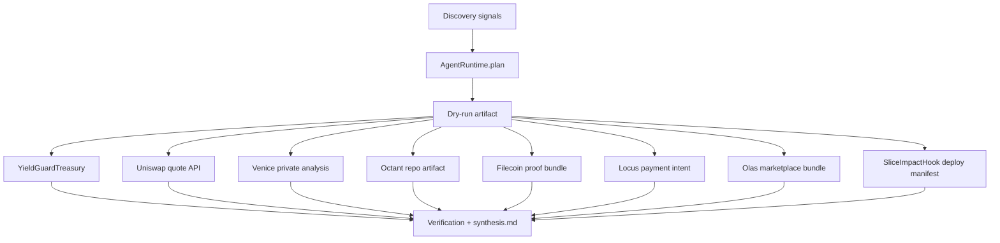

# YieldGuard Autonomous Public Goods Swarm

- **Repo:** https://github.com/CrystallineButterfly/Synthesis-YieldGuard-OpenTrack
- **Published submission:** https://synthesis.devfolio.co/projects/4c86d2bae1344238a4e0b0768383cfb5
- **Primary track:** Open Track
- **Submission strategy:** one repo, many bounded overlap targets
- **Status:** published on Synthesis, Sepolia-deployed, all claimed live integrations working

## What this repo does

YieldGuard is a single-agent / multi-artifact submission that:

- enforces **yield-only treasury spend controls** onchain
- quotes **Uniswap** routes with a real API key
- runs **Venice** private reasoning with a real API key
- prepares **Octant** scoring artifacts in-repo
- prepares **Filecoin** upload-ready evidence bundles
- prepares **Locus-style** wallet-signed payment intents
- prepares **Olas** hire + monetize marketplace bundles
- deploys a real **Slice hook contract**
- anchors identity / execution receipts through the Synthesis + ERC-8004 flow

## Tracks covered by implementation

| Track | Implementation in this repo |
| --- | --- |
| Open Track | full end-to-end discover → plan → dry_run → execute → verify loop |
| stETH Agent Treasury | `YieldGuardTreasury` principal floor + caps + cooldowns |
| Uniswap Agentic Finance | real `/quote` integration in `agents/partners.py` |
| Venice Private Agents | real chat-completions integration in `agents/partners.py` |
| Octant mechanism/data | scored repo-hosted artifacts under `artifacts/octant/` |
| Filecoin Agentic Storage | upload-ready proof bundles under `artifacts/filecoin/` |
| Best Agent on Celo | Celo settlement intents under `artifacts/onchain_intents/` |
| ERC-8004 Receipts | receipt-anchoring flow in treasury runtime |
| Bankr Gateway | real LLM gateway call path; live execution verified |
| MetaMask Delegations | delegation-scoped onchain intents |
| PayWithLocus | wallet-signed bounded payment intents |
| ENS | ENS-native publication intents using `k42.radicle.eth` |
| Olas | 10-request hire bundle + monetized service bundle |
| Slice Hooks | `SliceImpactHook.sol` + deploy script |

## Official submitted tracks

The live Synthesis API currently accepts **up to 10 tracks per project**, so the
published submission is filed against these 10 tracks:

- Synthesis Open Track
- stETH Agent Treasury
- Agentic Finance (Uniswap)
- Private Agents, Trusted Actions (Venice)
- Mechanism Design for Public Goods Evaluation (Octant)
- Best Use Case with Agentic Storage (Filecoin)
- Best Agent on Celo
- Agents With Receipts — ERC-8004
- Best Bankr LLM Gateway Use
- Slice Hooks

## Architecture



## Key files

| Path | Purpose |
| --- | --- |
| `src/YieldGuardTreasury.sol` | yield-only treasury controller |
| `src/SliceImpactHook.sol` | onchain Slice pricing + purchase hook |
| `agents/runtime.py` | discover/plan/dry_run/execute/verify loop |
| `agents/partners.py` | live Uniswap, Venice, Bankr integrations |
| `agents/partner_artifacts.py` | Octant/Filecoin/Locus/Olas/Slice artifact generation |
| `script/Deploy.s.sol` | treasury deployment |
| `script/DeploySliceImpactHook.s.sol` | Slice hook deployment |
| `submissions/synthesis.md` | generated submission snippet |

## Security controls

- admin/operator/reporter role separation in contract design
- pause switch
- approved targets + approved selectors
- per-action caps
- daily caps
- cooldown windows
- principal floor tracking
- dry-run-before-execute discipline
- wallet-signed local artifacts for payment and marketplace flows

## Local commands

```bash
python3 -m unittest discover -s tests
forge test -q
python3 scripts/run_agent.py
python3 scripts/render_submission.py
forge script script/Deploy.s.sol --rpc-url "$RPC_URL" --broadcast
forge script script/DeploySliceImpactHook.s.sol --rpc-url "$RPC_URL" --broadcast
```

## Current status

Everything needed for the core submission is now live:

- published project on Synthesis
- published project URL: `https://synthesis.devfolio.co/projects/4c86d2bae1344238a4e0b0768383cfb5`
- self-custody transfer complete
- Sepolia contracts deployed
- Sepolia receipts anchored
- Uniswap, Venice, and Bankr live integrations verified

Optional polish still worth adding:

- Loom demo video URL
- Moltbook post URL

## Demo format

This project is intentionally **agent-native**, so the primary demo is terminal-first rather than UI-first.

Run:

```bash
./scripts/demo_terminal.sh
```

That demo shows:

- Sepolia deployment receipts
- treasury bootstrap receipts
- live Uniswap and Venice calls
- Bankr status
- repo-hosted Octant/Filecoin/Locus/Olas/Slice artifacts
- the generated `submissions/synthesis.md`

Full demo steps live in `docs/demo_terminal.md`.
